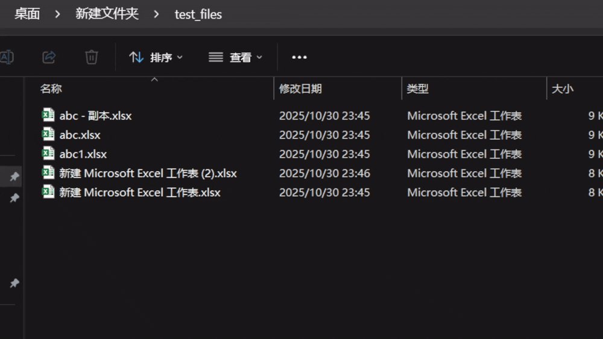

# xlsx和xlsb格式互转工具 (xlsx ↔ xlsb)

这个工具允许您在windows下使用右键菜单实现Excel的两种常用格式`.xlsx`和`.xlsb`互相转换。



## 文件结构

```
xlsx_to_xlsb/
├── install.bat          # 安装脚本，注册右键菜单
├── uninstall.bat        # 卸载脚本，移除右键菜单
├── readme.md            # 说明文档
└── vbs_script/
    ├── xlsxToxlsb.vbs   # xlsx转xlsb的VBS脚本
    └── xlsbToxlsx.vbs   # xlsb转xlsx的VBS脚本
```

## 安装与使用

### 安装

1. 在[releases](https://github.com/mingti/xlsx_to_from_xlsb_win/releases/latest)界面,下载`xlsx_to_from_xlsb_win.zip`包,解压在您的软件安装目录.
1. 使用管理员权限运行 `install.bat` 文件
2. 等待安装完成，您将在右键菜单中看到转换选项

### 使用方法

1. 在文件资源管理器中找到要转换的Excel文件
2. 右键点击文件，选择相应的转换选项：
   - "转换为XLSB" - 将.xlsx文件转换为.xlsb格式
   - "转换为XLSX" - 将.xlsb文件转换为.xlsx格式
3. 转换后的文件将保存在同一目录下

### 卸载

如需移除右键菜单选项，请使用管理员权限运行 `uninstall.bat` 文件

## 注意事项

- 转换后的文件将保存在同一目录下.
- 转换后原文件会删除.
- 建议在转换重要文件前先备份.
- 确保您的系统已安装Microsoft Excel.